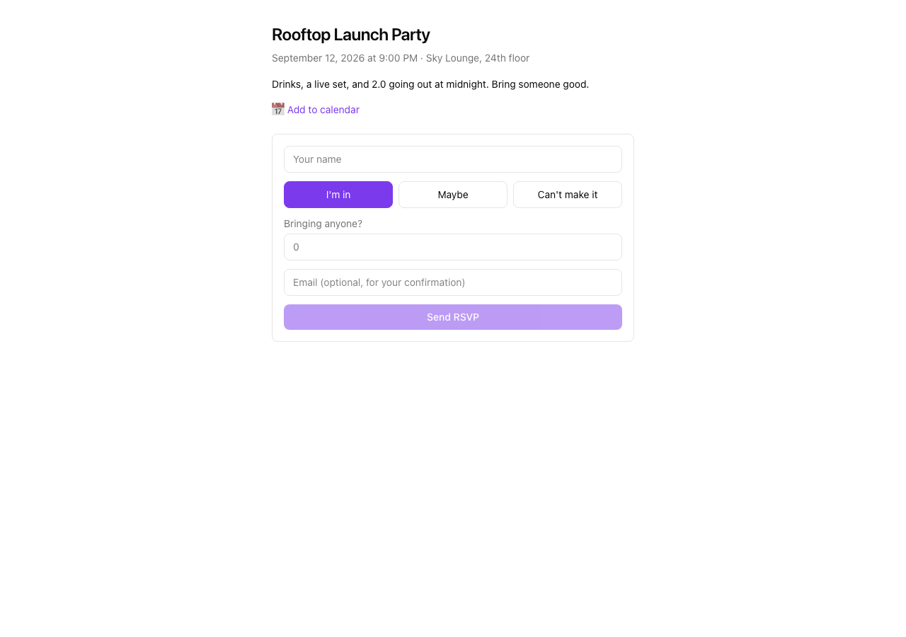

# ShowPony

A guest list / event RSVP app, built on [Kumiko](https://kumiko.rocks). Make an
event, share one link, and guests RSVP — no account, nothing to install.

It's a **reference sample**: a small, real, multi-tenant app that doubles as a
step-by-step tutorial. One host creates an event; anonymous guests RSVP on a
public page; the host watches the guest list fill up.



## Links

- 📖 **Tutorial** — [docs.kumiko.rocks/en/show-pony](https://docs.kumiko.rocks/en/show-pony/) — the whole build, chapter by chapter, with the real source embedded.
- 🚀 **Live demo** — [show-pony.kumiko.rocks](https://show-pony.kumiko.rocks) (read-only; login credentials on the sign-in screen)
- 🧩 **Kumiko** — [kumiko.rocks](https://kumiko.rocks) · [docs](https://docs.kumiko.rocks)

## Quickstart

You need [Bun](https://bun.sh) and Docker.

```bash
git clone https://github.com/CosmicDriftGameStudio/show-pony
cd show-pony
cp .env.example .env
docker compose up -d      # Postgres + Redis
bun install
bun dev
```

Then:

1. Open `http://show-pony.localhost:4180` and log in as `admin@show-pony.local` / `changeme`.
2. Create an event with a slug like `rooftop-launch`.
3. Open `http://demo.show-pony.localhost:4180/e/rooftop-launch` — the page your guests get. RSVP.
4. Back in the dashboard, the guest list has a new row.

`*.localhost` resolves to `127.0.0.1` automatically — no hosts-file edits.

## What it shows

The whole app turns on one idea: **the host is decided by the subdomain a
request arrives on, never by anything the guest sends.** A guest on
`acme.show-pony.…` writes into Acme's guest list and cannot reach anyone
else's — which is what makes a shared, anonymous app safe.

The [tutorial](https://docs.kumiko.rocks/en/show-pony/) walks the whole thing:
the data model, the anonymous multi-tenant write, the schema-driven host
dashboard, the public page, an `.ics` "add to calendar" link, and a
confirmation mail.

## Project layout

| Path | What's there |
|---|---|
| `src/feature.ts` | the `showpony` feature — entities, handlers, screens |
| `src/tenant-routing.ts` | subdomain → host-tenant resolver |
| `src/public/` | the guest-facing event page (React) |
| `src/i18n.ts` | the dashboard's text (de + en) |
| `bin/server.ts` | dev-server wiring (two bundles, host dispatch) |
| `e2e/screenshots/` | the Playwright runner that generates the doc images |

## Demo ops (learning sample)

Show Pony is a **throwaway demo + tutorial** — not a long-lived tenant database.
Treat prod demo data like a resettable fixture, not something to repair with
migration chains.

- **One demo-content seed** — `seeds/2026-06-28-demo-event-rsvps.ts`. When copy or
  guests change, edit that file and **reset the demo DB** (wipe Postgres or delete
  the seed’s row in `kumiko_es_operations`). Do **not** stack dated repair seeds.
- **Boot seeds must never throw** — `seedsDir: "./seeds"` in `bin/main.ts` runs on
  every prod pod start. A failing seed = crash loop / 503. See
  `src/__tests__/seed-boot-safety.test.ts`.
- **`bun dev` ≠ prod boot** — local dev (`bin/server.ts`) skips `seedsDir`; demo
  events are not seeded on localhost unless you create them in the UI or run the
  prod bootstrap. Before shipping seed changes, run `bin/main.ts` against Docker
  Postgres or read the pod init logs.
- **Deploy stuck? Fix the seed locally** — never patch k8s rollout strategy or
  scale tricks to paper over a boot failure.

Inline boot seeds (accounts, legal) live in `bin/main.ts` / `bin/server.ts` via
`seedAdmin` + `seedLegalContent` — idempotent, no dated files.

After code changes that affect [docs.kumiko.rocks](https://docs.kumiko.rocks/en/show-pony/)
embeds, sync the tutorial mirror:

```bash
./scripts/sync-docs-samples.sh
```

## Scripts

| Command | What it does |
|---|---|
| `bun dev` | run the app locally (needs `docker compose up -d`) |
| `bun run typecheck` | `tsc --noEmit` |
| `bun run lint` | Biome |
| `bun run screenshots` | regenerate the tutorial screenshots |

## License

MIT — see [LICENSE](LICENSE).


